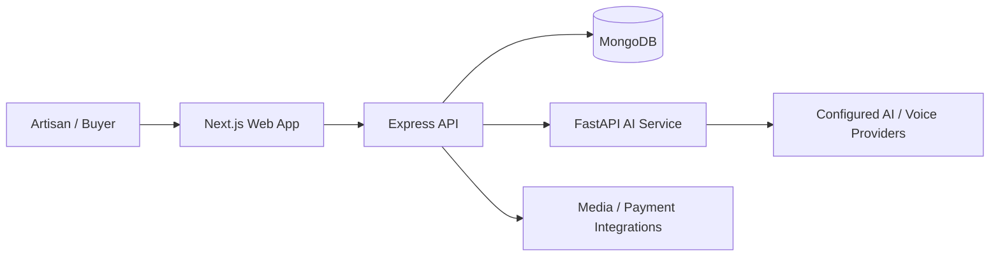

# Craftigari

### From a craftsperson's story to a digital storefront.

**Craftigari** is an AI-assisted marketplace prototype designed to help Indian artisans showcase and sell handmade products, especially when typing, writing detailed listings, or navigating conventional e-commerce platforms is difficult.

Instead of expecting every seller to be comfortable with forms and product descriptions, Craftigari explores a simpler approach: **show the product, speak about it, and let AI help prepare the listing.**

**Team:** KRYPHIX  
**Project type:** Hackathon prototype  
**Focus:** Artisan empowerment · Accessible commerce · Craft storytelling

---

## The problem

Skilled artisans create valuable handmade goods, but selling online often requires tasks unrelated to their craft:

- Writing product titles and descriptions.
- Using unfamiliar interfaces and languages.
- Photographing and explaining the steps behind their work.
- Estimating a fair selling price.
- Communicating with potential buyers and managing transactions.

For example, an artisan in Rajasthan may be excellent at making traditional handicrafts but uncomfortable filling out a long English-language product listing. Craftigari aims to reduce those barriers without requiring the artisan to become an e-commerce expert.

## Our solution

Craftigari brings **voice-assisted listing, AI-supported product content, craft-process storytelling, and a buyer-facing marketplace** into one experience.

The goal is not simply to translate an existing marketplace. It is to make *listing and presenting handmade work* easier for the person who creates it.

## Key features

| Feature | What it does |
| --- | --- |
| **Snap & Speak** | An artisan can share product photos and explain the item through speech. AI assists with preparing a structured listing. |
| **Multilingual assistance** | Speech-to-text and translation workflows support easier interaction across languages. |
| **AI product descriptions** | Helps generate editable product titles, descriptions, categories, and other listing details. |
| **Making Process** | Organizes material, work-in-progress, and finished-product photos into steps that explain how an item was created. |
| **Craft Passport** | A concept for a shareable/QR-linked view of the product's making story and artisan details. It is a storytelling feature, **not** independent proof of authenticity. |
| **Smart Pricing** | Offers pricing guidance using available product details; the seller remains responsible for the final price. |
| **Artisan marketplace** | Gives buyers a way to discover products and explore their makers. |
| **Deal Saathi** | Helps artisans handle buyer inquiries and quotation-related communication. |
| **Fair Deal Shield** | A proposed layer of guidance for clearer, fairer buyer–seller interactions. |
| **Payments and orders** | Explores a Razorpay-based checkout/order flow for the prototype. |
| **Artisan identity and trust** | Includes an identity-verification direction; a live government-backed Aadhaar verification integration should **not** be assumed. |

> **Prototype note:** The table describes the project's feature scope, not a guarantee that every workflow is live end-to-end. Some capabilities have been developed in code, while external-service credentials, real transactions, Aadhaar verification, and production behavior require separate validation.

## How Craftigari works

1. **Artisan joins** — creates or accesses an artisan profile.
2. **Uploads photos** — adds images of the handmade product.
3. **Speaks naturally** — describes the craft and product using a voice recording or supported input.
4. **AI assists** — helps convert the information into an editable product listing.
5. **Adds the making story** — supplies stages such as raw material, crafting, and finished work.
6. **Reviews and publishes** — checks the details and makes the product visible to buyers.
7. **Connects with buyers** — receives interest, discusses orders, and uses supported checkout workflows.

**Principle:** AI assists the artisan; it does not invent craftsmanship, certify authenticity, or make final business decisions for them.

## Tech stack

| Layer | Technology |
| --- | --- |
| Frontend | Next.js, React, JavaScript |
| Backend API | Node.js, Express.js |
| Database | MongoDB, Mongoose |
| AI service | Python, FastAPI |
| AI content generation | Gemini-based workflows |
| Voice and translation | Sarvam AI / BHASHINI-related integrations (depending on configuration) |
| Media storage | Cloudinary-related upload workflow |
| Payments | Razorpay integration / test-mode workflows |
| Collaboration | Git, GitHub |

## Architecture



### Repository structure

```text
CRAFTIGARI/
├── apps/
│   ├── web/                 # Next.js frontend
│   └── api/                 # Express backend
├── services/
│   └── ai/                  # FastAPI / Python AI service
├── shared/
│   └── contracts/           # Shared interface/contracts (where used)
├── docs/                     # Project and pitch documentation
├── qa/                       # Testing / QA resources
└── README.md
```

> Exact folder contents and scripts may change as development continues.

## Run locally

### Prerequisites

- Node.js and npm
- Python 3 and pip
- MongoDB connection string (for database-backed features)
- API keys for whichever AI, voice, image-storage, or payment features you want to test

### 1. Clone the repository

```bash
git clone <YOUR_REPOSITORY_URL>
cd CRAFTIGARI
```

Replace `<YOUR_REPOSITORY_URL>` with your project's actual GitHub URL.

### 2. Start the backend API

```bash
cd apps/api
npm install
npm run dev
```

**Expected local API URL:** `http://localhost:4000`  
**Health check:** `http://localhost:4000/health`

### 3. Start the AI service (new terminal)

```bash
cd services/ai
python -m pip install -r requirements.txt
python -m uvicorn app.main:app --reload --port 8000
```

**Expected local AI URL:** `http://127.0.0.1:8000`

If Windows blocks port `8000`, choose another free port, such as `8001`, and update the backend's configured `AI_SERVICE_URL` accordingly.

### 4. Start the web app (new terminal)

```bash
cd apps/web
npm install
npm run dev
```

Open **http://localhost:3000**.

### 5. Configure environment variables

Use the `.env.example` files in the relevant packages (when present) as the source of truth. Depending on which features are enabled, configuration may include:

```dotenv
# Database / backend
MONGODB_URI=your_mongodb_connection_string
AI_SERVICE_URL=http://127.0.0.1:8000
INTERNAL_API_KEY=your_private_internal_api_key

# Frontend -> backend
NEXT_PUBLIC_API_URL=http://localhost:4000

# Voice / translation (where supported)
VOICE_TRANSLATION_PROVIDER=sarvam
SARVAM_API_KEY=your_sarvam_api_key
```

These are **illustrative values**, not a complete verified `.env` template. Put each key in the package that reads it, verify actual variable names against the source code, and configure Gemini, Cloudinary, Razorpay, OTP, and other service credentials only where required.

**Never commit `.env` files, real API keys, Aadhaar numbers, OTPs, or customer data.**

## Demo walkthrough

For a short hackathon demonstration:

1. Open the artisan-facing interface.
2. Show how a product photo and spoken description can reduce typing.
3. Review the AI-assisted listing before publishing.
4. Show the **Making Process** section and the product's story.
5. Open the buyer-facing product view.
6. Demonstrate inquiry, quotation, or payment flows **only if they are working in the current build**; otherwise identify them clearly as prototype concepts.

A strong demo focuses on one complete, reliable flow instead of clicking through unfinished features.

## Current status and limitations

Craftigari is a **hackathon prototype**, not a production-certified commerce or identity platform.

- The frontend, Express API, and FastAPI service have been developed as separate modules.
- Internal code/test checks have been reported, but successful tests alone do not establish that external services work live.
- Real speech-provider calls depend on correctly configured credentials and network access.
- Database operations require a working MongoDB configuration.
- Razorpay test payments are not equivalent to real settled transactions or identity verification.
- Aadhaar verification must not be described as live or government-approved unless an authorized integration has actually been implemented and tested.
- Craft photos and AI-generated descriptions do not independently verify authenticity, pricing fairness, or ownership.

## Future improvements

- Improve the low-text, voice-first artisan journey.
- Validate multilingual speech flows with real users and supported languages.
- Strengthen listing review, moderation, and seller consent.
- Expand the Making Process / Craft Passport experience.
- Improve secure identity verification and buyer trust signals.
- Harden order, payment, support, and deployment workflows.
- Test accessibility and usability with artisans, not just developers.

## Built by Team KRYPHIX

Craftigari was developed as a hackathon effort to explore more accessible digital commerce for traditional Indian artisans.

**Made to help the people behind handmade products be seen and heard.**
